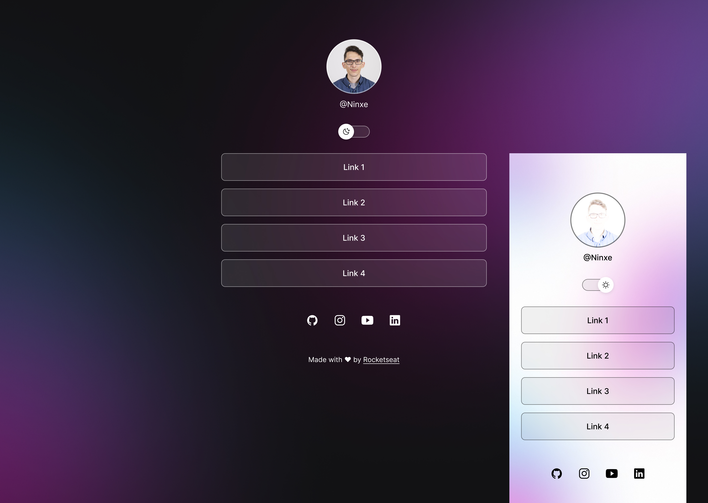

<h1 align="center">Digital Business Card</h1>

  <a href="#-technologies">Technologies</a>&nbsp;&nbsp;&nbsp;|&nbsp;&nbsp;&nbsp;
  <a href="#-project">Project</a>&nbsp;&nbsp;&nbsp;

  

 

  

## 🚀 Technologies

This project was developed by these next technologies:

- HTML & CSS
- JavaScript
- Git & Github
- Figma

## 💻 Project

Digital Business Card is a link aggregator.

---

Made with ♥ by Rocketseat :wave:
